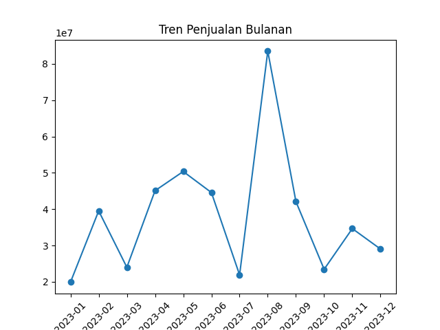
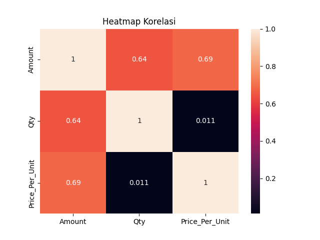
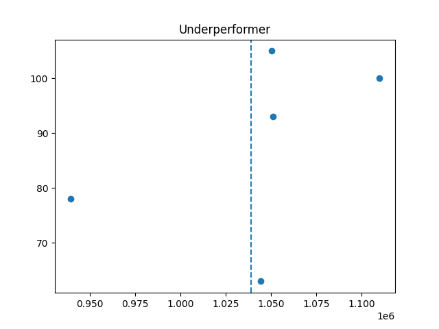
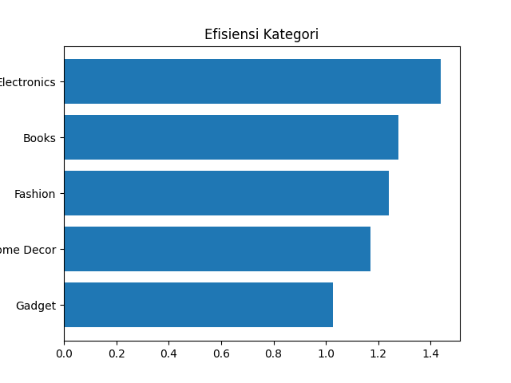

# Proyek Analisis Data Penjualan (Final Praktikum)

Proyek ini adalah sistem analisis data otomatis yang dirancang untuk mengolah dataset penjualan, melakukan pembersihan data, serta menghasilkan berbagai visualisasi dan wawasan statistik (seperti RFM Analysis, Uji Hipotesis, dan Regresi Linear).

## 🚀 Fitur Utama

- **Auto-Adapt Dataset**: Mendukung berbagai penamaan kolom (misal: `Order_Date` vs `order_date`) secara otomatis.
- **Data Cleaning**: Pembersihan data otomatis dari nilai null dan data yang tidak valid.
- **Visualisasi Tren**: Menghasilkan grafik tren penjualan bulanan.
- **Analisis Underperformer**: Mengidentifikasi produk/kategori dengan harga tinggi namun kuantitas penjualan rendah.
- **RFM Analysis**: Segmentasi pelanggan berdasarkan *Recency*, *Frequency*, dan *Monetary*.
- **Analisis Efisiensi**: Menghitung efisiensi anggaran iklan terhadap pendapatan per kategori.
- **Uji Hipotesis**: Melakukan t-test statistik untuk melihat pengaruh anggaran iklan terhadap penjualan.
- **Prediksi Regresi**: Menggunakan Linear Regression untuk memprediksi potensi penjualan berdasarkan anggaran iklan.

## 📁 Struktur File

- `main.py`: Script utama pemrosesan dan analisis data.
- `data_praktikum_analisis.csv`: Dataset utama yang dianalisis.

## 📊 Visualisasi Hasil

Berikut adalah beberapa hasil visualisasi yang dihasilkan oleh sistem:

### 1. Tren Penjualan Bulanan


### 2. Heatmap Korelasi


### 3. Analisis Underperformer


### 4. Efisiensi Kategori


## 🛠️ Persyaratan Sistem

Pastikan Anda telah menginstal Python dan pustaka berikut:

```bash
pip install pandas matplotlib seaborn scikit-learn scipy
```

## 💻 Cara Menjalankan

1. Letakkan file dataset `data_praktikum_analisis.csv` di direktori yang sama dengan `main.py`.
2. Jalankan script menggunakan perintah:
   ```bash
   python main.py
   ```
3. Hasil analisis akan muncul di terminal, dan file gambar visualisasi akan diperbarui secara otomatis.

## 📊 Hasil Analisis

Setelah dijalankan, program akan menampilkan:
- Daftar kategori **Underperformer**.
- Daftar **Top Customers** berdasarkan skor RFM.
- Nilai **p-value** dari uji hipotesis.
- Nilai **R-Squared (R2)** dari model prediksi regresi.
- Kesimpulan kategori terbaik dan terburuk berdasarkan efisiensi.
